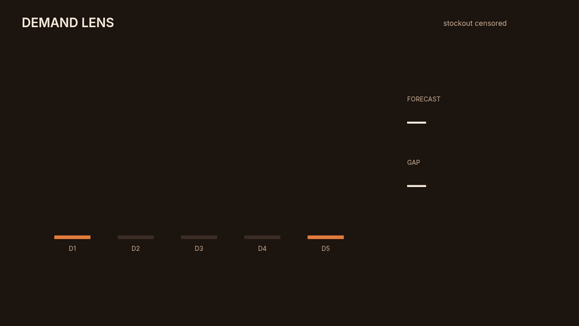

# Demand Lens

Intermittent-demand forecast that does not treat a stockout as a sale of zero.

[](https://www.python.org)
[](LICENSE)

## The problem this solves

Average daily sales lies in two common cases. A SKU that sells nine units once every few days looks almost idle if you average the zeros in between, so the buyer under-orders it. A day the shelf was empty looks like a day nobody wanted the item, so the buyer repeats the stockout.

Demand Lens keeps size and gap separate. Positive sales update a smoothed size. The gap counts only days the item could have sold. A stockout day is censored: it is counted, and it does not stretch the gap. The published rate is smoothed size divided by smoothed gap. A gap above 1.5 periods is marked intermittent. Negative units raise. A stockout day that also records sales raises, because that row contradicts itself.

The forecast is from the history the caller passes in. It is not a connection to a store system.

## Watch the demo

<p align="center">
  
</p>

Play the video: [docs/watch.html](docs/watch.html)

## Quick start

```bash
python3 -m venv venv
source venv/bin/activate
pip install -e ".[dev]"
python -m demand_lens
python -m demand_lens.harness
python -m unittest discover -s tests -v
```

```python
import asyncio
from demand_lens import DemandLens

report = asyncio.run(
    DemandLens().run(
        [
            {"sku": "lumpy", "day": 1, "units": 9, "stockout": False},
            {"sku": "lumpy", "day": 2, "units": 0, "stockout": False},
            {"sku": "lumpy", "day": 3, "units": 0, "stockout": False},
            {"sku": "lumpy", "day": 4, "units": 0, "stockout": False},
            {"sku": "lumpy", "day": 5, "units": 9, "stockout": False},
        ]
    )
)
```

## Bounds

| Rule | Behavior |
| --- | --- |
| Negative or non-finite units | Raises |
| Stockout day with units above zero | Raises |
| Duplicate day for one SKU | Raises |
| Stockout day | Censored. It does not advance the gap |
| Smoothed gap above 1.5 | Marked intermittent |
